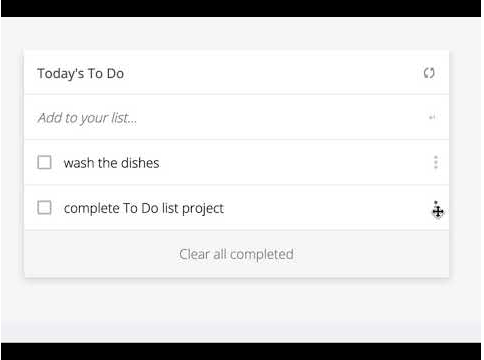

# To-Do-List
<a name="readme-top"></a>

<div align="center">


  <h3><b>To do List Project</b></h3>
</div>

<h1>Capstone Project Module-1</h1>

<!-- TABLE OF CONTENTS -->

# 📗 Table of Contents

- [📖 About the Project](#about-project)
  - [🛠 Walk through](#walk-through)
  - [🛠 Built With](#built-with)
    - [Tech Stack](#tech-stack)
    - [Key Features](#key-features)
  - [🚀 Live Demo](#live-demo)
- [💻 Getting Started](#getting-started)
  - [Setup](#setup)
  - [Prerequisites](#prerequisites)
  - [Install](#install)
- [👥 Authors](#authors)
- [🔭 Future Features](#future-features)
- [🤝 Contributing](#contributing)
- [⭐️ Show your support](#support)
- [🙏 Acknowledgements](#acknowledgements)
- [❓ FAQ](#faq)
- [📝 License](#license)

<!-- PROJECT DESCRIPTION -->

# 📖 To Do List <a name="about-project"></a>

"To Do List" is a simple website that create a do List to check everyday task and remove what have been completed


<!-- > Describe your project in 1 or 2 sentences. -->
### How to build the "To Do List" 
- 1: Manage Daily task (plain JS with objects).
- 2: Shows list of tasks to be done (plain JS with classes) and add basic CSS.
- 3: Create a complete List of tasks to be done and update it.

**New Features add**
- CRUD (create, read, update, delete) methods. All the elements of the user interface will be fully functional and your application will be completed.

-  Functionality to application to make it interactive.

Will start by building the core functionalities and ignoring how the website looks. At the very beginning the website will look similar to the UI below. Note that it is plain HTML with no styling, but it will allow to add and remove books from the list!

<p align="center">
  
</p>

Once have the code working, will play with refactoring it. In this step will also need to adhere to the layout presented in the wireframe, but i will choose the application's styling. So i initial ugly HTML will turn into better with higher
functionality as described in the following video:

<p align="center">
  <a href="https://www.youtube.com/watch?v=AcUd-_Yjjqg" width="400px">Watch the Video</a>
</p>


**To Do List** is an Html,CSS&JavaScript-based project with the implementation of Webpack implementation including development server.

# Responsive website for communities events and particpants details <a name="about-project"></a>
This project is about creating a responsive website to showcase community event, activities and agenda. This is a implementation of SINGLE PAGE APPLICATION widely known as SPA.

<!-- > Describe your project in 1 or 2 sentences. -->
To Do List: mobile-first approach & responsive on desktop version and bigger size is the first capstone project in the process of experiences mimic real-world projects where we must apply what we learned throughout the entire Module, and are built with business specifications that will look really nice in our portfolio. This is a Single Page Application project where in a single page all elements are called through JavaScript Dynamic programming. Along with webpack implementation.

## 🛠 Walk through <a name="walk-through"></a>
<ul>
  <li><a href="https://github.com/microverseinc/curriculum-javascript/blob/main/todo-list/m1_list_structure.md">See the Project Requirement</a></li>
  <li>If required you should personalize the content of your page. Choose a topic that is different than the one in the original design</li>


## 🛠 Built With <a name="built-with"></a>

### Tech Stack <a name="tech-stack"></a>

<!-- > Describe the tech stack and include only the relevant sections that apply to your project. -->
<details>
  <summary>Client Side / Front-End</summary>
  <ul>
    <li><a href="https://www.w3.org/html/">HTML</a></li>
    <li><a href="https://www.w3.org/Style/CSS/">CSS</a></li>
    <li><a href="https://www.javascript.com/">Javascript</a></li>
    <li><a href="https://webpack.js.org/guides/getting-started/">Webpack</a></li>
  </ul>
</details>

<details>
  <summary>Server Side / Back-End</summary>
  <ul>
    <li><a href="https://www.json.org/json-en.html">JSON</a></li>
    <!-- <li><a href=""> - </a></li>
    <li><a href=""> - </a></li> -->
  </ul>
</details>

<!-- Features -->
### Tools i have used for this project <a name="tools"></a>
  <details>
    <summary>Code Convention, Code Analysis</summary>
      <ul>
        <li><a href="https://eslint.org/">ESLint</a></li>
        <li><a href="https://webhint.io/">Webhint</a></li>
        <li><a href="https://stylelint.io/">Stylelint</a></li>
        <li><a href="https://chrome.google.com/webstore/detail/lighthouse/blipmdconlkpinefehnmjammfjpmpbjk?hl=en">Lighthouse</a></li>
        <li><a href="https://www.npmjs.com/package/npm-check">node_modules checker</a></li>
      </ul>
  </details>
  <details>
    <summary>Version Control, CI/CD, Hosting Service</summary>
      <ul>
        <li><a href="https://pages.github.com/">Github Pages</a></li>
        <li><a href="https://github.com/features/actions">Github Actions</a></li>
        <li><a href="https://git-scm.com/">Git</a></li>
      </ul>
  </details>
  <details>
    <summary>IDE, Desktop Apps, Other Tools</summary>
      <ul>
        <li><a href="https://code.visualstudio.com/">Visual Studio Code</a></li>
        <li><a href="https://desktop.github.com/">Github Desktop</a></li>
        <li><a href="https://www.behance.net/">Behance</a></li>
        <!-- <li><a href="https://www.figma.com/">Figma</a></li> -->
      </ul>
  </details>

### Key Features <a name="key-features"></a>

<!-- > Describe between 1-3 key features of the application. -->
- Mobile First Approach
- Responsive Website
- Button Interactions (i.e. hover, etc.)
- Attractive Images & Design
- Modal/dialog
- Dynamic page (data is retrieved from JSON file)

<p align="right">(<a href="#readme-top">back to top</a>)</p>


## 🚀 Live Demo <a name="live-demo"></a>
[Live Demo Link](https://Elhambasir.github.io/To-Do-List/)


## 💻 Getting Started <a name="getting-started"></a>
### Hi, there, I'm Rassel - aka [Full Stack Developer] [Check my portfolio](https://elhambasir.github.io/MyPortfolio/)

To get a local copy up and running, follow these steps.

### Prerequisites

In order to run this project you need:
- git version 2.38.x
- node.js version > 12.x
- IDE
- browser (chrome, firefox, edge, safari)

### Setup

Clone this repository to your desired folder:

```sh
  cd my-folder
  git git@github.com:RHK-MICROVERSE/To-Do-List.git
```


### Install

Install this project with:

```sh
  cd my-project
  node install
```

### Usage

To run the project, execute the following command:
run live server

<!--
```sh
  rails server
```
-->

### Run tests

To run tests, run the following command:
Run Github Actions Test
```sh
  npx stylelint "**/*.{css,scss}"
```

### Deployment

This project is deployed at github pages you can clone it here. [Please click to clone](https://github.com/Elhambasir/To-Do-list)

<p align="right">(<a href="#readme-top">back to top</a>)</p>


## 👥 Authors <a name="Basir Elham"></a>
- Main Author: **Basir Elham**
  
👤 **Basir Elham**

- GitHub: [@githubhandle](https://github.com/Elhambasir)
- Linkedin: [@linkedinhandle](https://www.linkedin.com/in/basir-ahmadi-8aba89263)
- Email: elham1378basir@gmail.com

<p align="right">(<a href="#readme-top">back to top</a>)</p>

## 🔭 Future Features <a name="future-features"></a>

- [ ] **Dynamic content.**
- [ ] **Add functionality of Javascript**
- [ ] **Will add some background **
- [ ] **Dynamic control of adding and deleting task through check box **


## 🤝 Contributing <a name="contributing"></a>

Contributions, issues, and feature requests are welcome!

Feel free to check the [issues page](https://github.com/Elhambasir/To-Do-list/issues).

<p align="right">(<a href="#readme-top">back to top</a>)</p>


## ⭐️ Show your support <a name="support"></a>

If you like this project give a star to this repositiory.

<p align="right">(<a href="#readme-top">back to top</a>)</p>


## 🙏 Acknowledgments <a name="acknowledgements"></a>

I would like to thank the Microverse full-stack curriculum for the inspiration and guidance. Original design idea by Emilia Andrzejewska.

<p align="right">(<a href="#readme-top">back to top</a>)</p>


## ❓ FAQ <a name="faq"></a>

- **Is it allowed to copy the contents of this project and use it for personal use?**

  - Yes, this project is free for copying and reusing in any way you like.

  - How often will the future features will be implemented?

  - As this is personal porfolio, the owner will update this projects pages more frequently with every enhancements in personal status.


## 📝 License <a name="license"></a>

This project is under [MIT](./LICENSE) licensed.

<p align="right">(<a href="#readme-top">back to top</a>)</p>
